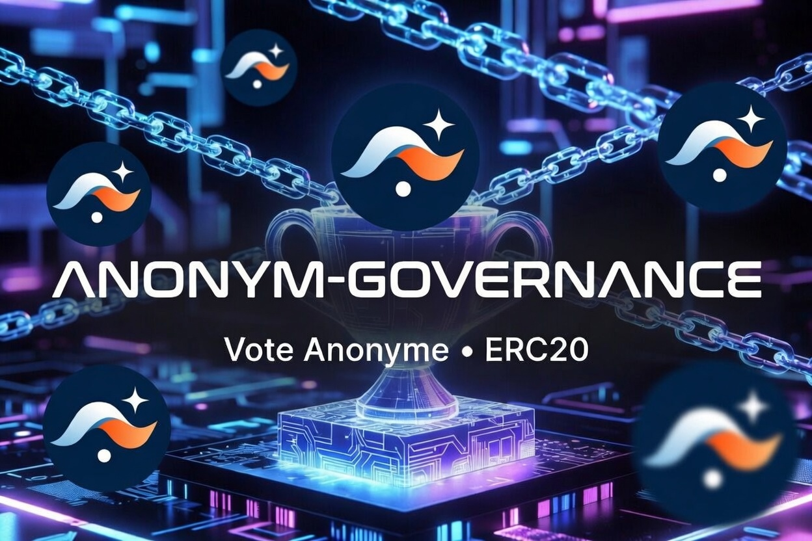

# ERC20 Anonymous Governance Vote

A Starknet governance system built in Cairo that combines on-chain proposal management with **fully anonymous voting** via [SNIP-36 — In-Protocol Proof Verification](https://community.starknet.io/t/snip-36-in-protocol-proof-verification/116123). Voters can participate in governance without revealing their identity or their choice on-chain.



> **Status:** Experimental / research. The `GovernorCountingAnonymousComponent` is not audited.

---

## Architecture

The system is composed of two upgradeable contracts.

### GovToken (`src/token.cairo`)

An ERC20 governance token that tracks voting power via checkpoints.

| Component | Role |
|---|---|
| `ERC20Component` | Standard fungible token |
| `VotesComponent` | Voting power checkpoints keyed by block number (`ERC6372BlockNumberClock`) |
| `NoncesComponent` | Required for `delegate_by_sig` |

Every token transfer triggers `after_update`, which calls `votes.transfer_voting_units(...)` to keep checkpoints in sync. Holders must **delegate** their voting power (to themselves or to another address) before it is counted.

### AnonGovernor (`src/governor.cairo`)

A governance contract that handles the full proposal lifecycle and replaces standard vote counting with anonymous vote counting.

| Component | Role |
|---|---|
| `GovernorComponent` | Proposal lifecycle: `propose`, `execute`, `cancel`, `state` |
| `GovernorCountingAnonymousComponent` | Anonymous vote counting via SNIP-36 |
| `GovernorVotesComponent` | Reads past voting power from `GovToken` |
| `GovernorSettingsComponent` | Configurable `voting_delay`, `voting_period`, `proposal_threshold` |
| `GovernorCoreExecutionComponent` | On-chain call execution |

**Key difference from standard Governor:** `cast_vote*` functions panic with `'Use cast_anonymous_vote'`. Only anonymous votes are accepted.

**Quorum** is set at construction in a dedicated `Governor_quorum` storage slot and is not modifiable through governance proposals.

---

## Anonymous Vote Flow

Anonymous voting relies on a **proof server** and a **backend account**. The proof server generates SNIP-36 proof facts; the backend account submits the transactions. Without both, the on-chain contract cannot verify a vote.

> **Wallet limitations:** Standard Starknet wallets (Argent, Braavos, …) can only be used for Step 1 (signing the SNIP-12 message). The two subsequent steps cannot go through a wallet:
> - Calling `create_proof` requires building a raw `INVOKE_TXN_V3` transaction using `account.getSignedTransaction()` from [`github:PhilippeR26/starknet.js#buildExecute`](https://github.com/PhilippeR26/starknet.js/tree/buildExecute). This transaction is submitted by the **backend account**, which has its own private key (not the voter's) and must hold enough STRK to cover the virtual execution fees (fees are not physically spent since it is a virtual transaction).
> - Submitting `cast_anonymous_vote` is also done by the **backend account**, this time on the real network (real fees).

### Step 1 — Off-chain: sign the vote message

The voter signs a **SNIP-12 typed message** with their private key, via their wallet or browser extension. The message encodes:

- `proposal_id` — the proposal being voted on
- `support` — `0` (Against), `1` (For), or `2` (Abstain)
- domain separation fields defined by the SNIP-12 schema (`name`, `version`, `chain_id`, `contract_address`)

The resulting Starknet ECDSA **signature `(r, s)`** is sent to the proof server. It serves two purposes:

- **Identity verification** — from `(r, s)` and the SNIP-12 message hash, the voter's public key can be recovered. The proof server reads the public key stored in the voter's account and checks that the recovered key matches, confirming the signer is the legitimate owner of that account.
- **Nullifier derivation** — the same `(r, s)` are hashed with `proposal_id` to produce a unique, one-time nullifier that prevents any replay of the same vote.

### Step 2 — Off-chain: generate the proof facts

The proof server, acting through the **backend account**, builds a signed `INVOKE_TXN_V3` transaction calling `create_proof(proposal_id, support, AnonVotePrivateInput { signature: [r, s] })` and runs it in the SNIP-36 virtual OS:

1. Verifies the voter's identity (public key recovery from the SNIP-12 signature — see above).
2. Reads the voter's **voting weight** from the token's checkpoint at the proposal snapshot block (fetched directly from on-chain state, not supplied by the voter).
3. Derives the **nullifier**: `poseidon(NULLIFIER_DOMAIN, proposal_id, poseidon(r, s))`.
4. Builds `AnonVoteMessage { proposal_id, nullifier, support, weight }` and computes its **hash** — this tamper-proof commitment is later verified on-chain: the contract recomputes the same hash from the submitted message and checks it against the proof facts, ensuring the vote data was not altered between proof generation and submission.
5. Commits the message hash as an **L2→L1 message**, binding the vote intent to the chain without revealing it in plain text.
6. Returns the **proof facts** (the L2→L1 message payload read by `get_execution_info_v3_syscall`) and the **STARK proof** that the sequencer will verify.

The voter's identity and their choice never appear in plain text on-chain.

### Step 3 — On-chain: cast the vote

The voter submits a transaction (built outside of any Starknet wallet) calling `cast_anonymous_vote(AnonVoteMessage)` with the proof facts attached. The contract:

1. Reads **proof facts** from `get_execution_info_v3_syscall` (SNIP-36 mechanism).
2. Verifies the message hash recomputed from `AnonVoteMessage` matches the hash in the proof facts.
3. Checks the nullifier has not been used (`is_nullifier_used`).
4. Marks the nullifier as consumed and tallies the vote.

---

## Proposal Lifecycle

```
propose → [voting_delay blocks] → Active → [voting_period blocks] → Succeeded / Defeated
                                                                          ↓
                                                                       execute
```

| State | Description |
|---|---|
| `Pending` | Proposal created, waiting for `voting_delay` to elapse |
| `Active` | Voting window open — voters cast anonymous votes |
| `Succeeded` | Quorum reached and `For` votes > `Against` votes |
| `Defeated` | Quorum not reached, or `Against` ≥ `For` |
| `Executed` | On-chain calls have been dispatched |
| `Canceled` | Canceled by the proposer or owner |

---

## Replay Protection

Each vote produces a unique nullifier bound to `(proposal_id, r, s)`. The contract stores consumed nullifiers and rejects any `cast_anonymous_vote` that presents a known nullifier. Use `is_nullifier_used(proposal_id, nullifier)` to check before submitting.

The standard `has_voted` entrypoint always returns `false` — it is meaningless in an anonymous scheme.

---

## Governance Settings

Settings are modifiable through governance proposals (any `Succeeded` proposal can update them):

| Setting | Default (tests) | Description |
|---|---|---|
| `voting_delay` | 1 block | Delay between proposal and vote start |
| `voting_period` | 50 blocks | Length of the voting window |
| `proposal_threshold` | 1 × 10¹⁸ | Minimum voting power to submit a proposal |
| `quorum` | 100 000 × 10¹⁸ | Fixed at deployment, not modifiable |

---

## Examples and Related Projects

- **Usage examples** (TypeScript scripts using starknet.js): [starknet.js-workshop-typescript — Starknet142-Sepolia](https://github.com/PhilippeR26/starknet.js-workshop-typescript/tree/main/src/scripts/Starknet142/Starknet142-Sepolia)
- **Full governance DApp**: [ERC20-anonym-governance-DAPP](https://github.com/PhilippeR26/ERC20-anonym-governance-DAPP)
- **Proof server implementation**: [secure-voty — proofServer](https://github.com/PhilippeR26/secure-voty/tree/main/proofServer)

---

## Development

Tool versions are pinned in [.tool-versions](.tool-versions).

```bash
# Build
scarb build

# Run all tests
snforge test

# Run a specific test
snforge test test_cast_anonymous_vote_ok

# Run tests matching a pattern
snforge test test_cast_anonymous_vote
```

Tests are integration tests: both `GovToken` and `AnonGovernor` are deployed as external contracts via `snforge_std`. SNIP-36 proof facts are simulated with `start_cheat_proof_facts` / `stop_cheat_proof_facts`.

### Dependencies

The project depends on a **private fork** of OpenZeppelin Cairo contracts that includes `GovernorCountingAnonymousComponent`:

```toml
openzeppelin = { git = "https://github.com/PhilippeR26/OZ-contracts", branch = "anon-vote-frontend" }
```

`allowed-libfuncs-list.name = "all"` is required in `Scarb.toml` because `GovernorCountingAnonymousComponent` uses `get_execution_info_v3_syscall`.

---

## License

MIT
